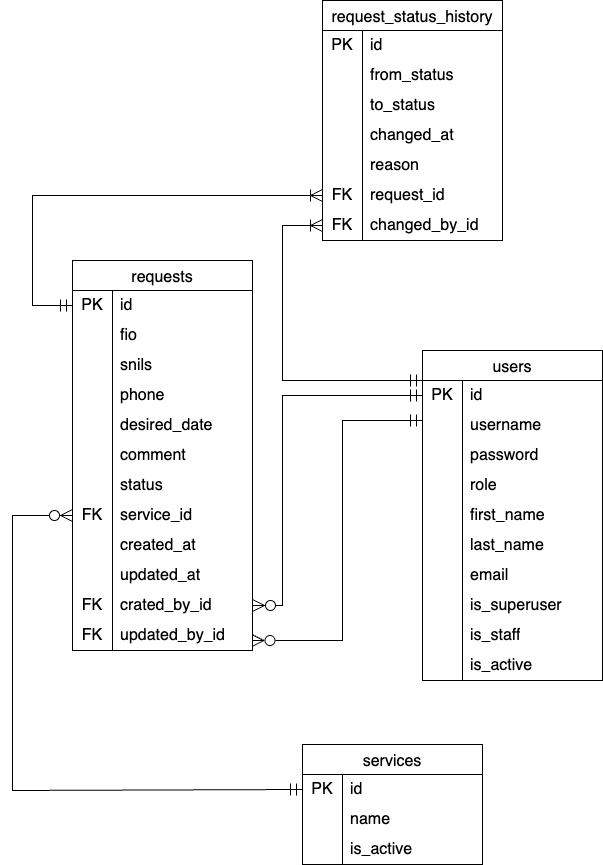

# Журнал заявок на медицинские услуги

Веб-сервис для операторов колл-центра и руководителей.

Стек: Django REST Framework + PostgreSQL + React (Vite) + Docker Compose.


## Запуск

1. Скачать zip-проекта

2. Открыть docker

3. Открыть терминал

4. Перейти в папку проекта:
   ```bash
   cd ~/Downloads/medical_journal-main
   ```
   Для очистки контейнера:
   ```bash
   docker compose down
   ```
5. Запустить проект одной командой:
   ```bash
   docker compose up --build
   ```
   Поднимутся три контейнера — `db`, `backend`, `frontend`. Миграции и демо-данные применяются автоматически.

6. Открыть в браузере: **http://localhost:5173**

7. Войти под одной из готовых учётных записей:

   | Логин      | Пароль        | Роль     |
   |------------|---------------|----------|
   | `operator` | `operator123` | OPERATOR — создаёт заявки, меняет статусы |
   | `viewer`   | `viewer123`   | VIEWER — только просмотр журнала и статистики |
   | `admin`    | `admin123`    | ADMIN — суперпользователь, доступ в Django admin (`/admin/`) |

## Тесты

```bash
docker compose exec backend pytest
```

Валидация СНИЛС, матрица переходов статусов, доступ по ролям, пагинация/фильтрация журнала, агрегация статистики.

## Админка

`http://localhost:8000/admin/` — доступна только регистрация и редактирование пользователей.

## API

Аутентификация: `POST /api/auth/login/` (`username`, `password`) → JWT `access` и `refresh`-токены


| Метод и путь | Доступ | Описание |
|---|---|---|
| `POST /api/auth/login/` | все | вход, возвращает токен и роль |
| `GET /api/services/` | OPERATOR, VIEWER | справочник активных услуг |
| `GET /api/requests/` | OPERATOR, VIEWER | журнал заявок: пагинация, фильтры (`status`, `service`, `desired_date_from/to`, `search`), сортировка (`ordering=created_at\|-created_at\|desired_date\|-desired_date`) |
| `POST /api/requests/` | OPERATOR | создание заявки |
| `GET /api/requests/{id}/` | OPERATOR, VIEWER | заявка с историей статусов |
| `PATCH /api/requests/{id}/` | OPERATOR | редактирование заявки (`patient_fio`, `patient_phone`, `desired_date`, `comment`); доступно только в статусах NEW/IN_PROGRESS, иначе 409 |
| `POST /api/requests/{id}/change-status/` | OPERATOR | смена статуса (`status`, `reason` — обязательна при отмене) |
| `GET /api/requests/statistics/` | OPERATOR, VIEWER | сводка по статусам/услугам за период |

## Схема БД

